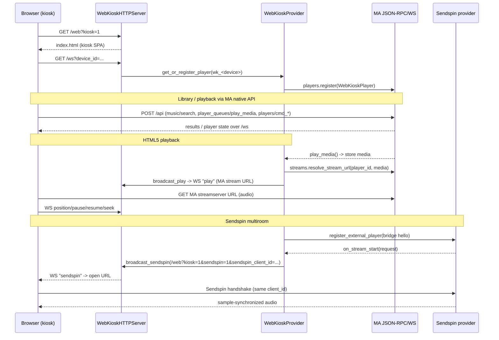

## Problem Statement

A user who only wants a fullscreen, always-on browser kiosk player (a spare
tablet, a Raspberry Pi display, or a TV's browser) today has to install the
MSX Bridge provider and use its `/web?kiosk=1` mode. The kiosk frontend and its
playback plumbing are embedded in the MSX Bridge provider, coupled to a Smart
TV protocol the kiosk user does not need, and cannot be configured, versioned,
or shipped independently.

## Solution Summary

Introduce a thin standalone `web_kiosk` player provider. It runs a minimal
embedded HTTP server that only serves the kiosk SPA (`/web`), a per-player
push WebSocket (`/ws`), and a health endpoint (`/health`); it registers each
browser as a dedicated `WebKioskPlayer` (`wk_`-prefixed id). Everything else is
delegated to Music Assistant's own native API: the kiosk frontend browses,
searches, manages the queue, fetches lyrics and party status, and sends
playback commands through MA's JSON-RPC API (`POST /api`) and WebSocket
(`/ws`), exactly like the built-in MA web interface. HTML5 audio is served by
the MA streamserver; Sendspin multiroom is provided by a web-kiosk bridge role
that registers the kiosk as an external Sendspin client and opens the kiosk in
Sendspin mode when a synchronized stream starts. The corresponding
functionality in `msx_bridge` is marked deprecated (CHANGELOG + docs only,
behaviour unchanged) for removal in a future release.

## Acceptance Criteria

1. Installing the `web_kiosk` provider serves `/web` and registers a browser
   client as a Music Assistant player (`wk_`-prefixed id) with the
   PLAY_MEDIA / PAUSE / SEEK / VOLUME_SET feature set.
2. The provider's own HTTP server exposes only the kiosk SPA, the per-player
   push WebSocket, and `/health` — it does not duplicate MA library/search/
   queue/party endpoints.
3. The kiosk frontend drives library browsing, search, queue, lyrics, and
   party status through MA's native JSON-RPC (`POST /api`) and WebSocket
   (`/ws`) APIs.
4. HTML5 playback works: the provider resolves a MA streamserver URL for the
   player's current media and pushes it to the kiosk over `/ws`; the kiosk
   reports `position`/`pause`/`resume`/`seek` and the provider updates player
   state.
5. Sendspin multiroom works: the kiosk's vendored Sendspin JS client registers
   as a Sendspin client and joins sample-synchronized groups; the web-kiosk
   bridge opens the kiosk in Sendspin mode when a synchronized stream starts;
   when Sendspin is unavailable the provider degrades to HTTP playback without
   failing to load.
6. `msx_bridge` marks its web-kiosk functionality deprecated via a canonical
   `### Deprecated` CHANGELOG entry and doc notes only; runtime behaviour and
   URLs stay unchanged.
7. The provider passes `ma_verify` (ruff format/check, mypy, pytest,
   pre-commit) and `ma_consistency features`.

## Test Plan

- `tests/test_init.py` — pins manifest/domain, `SUPPORTED_FEATURES`, and the
  config entries exposed by `get_config_entries`.
- `tests/test_provider.py` — provider lifecycle: HTTP server start/stop,
  player registration under the `wk_` prefix, stream-token derivation, idle
  timeout, Sendspin bridge availability degradation.
- `tests/test_player.py` — `WebKioskPlayer` state machine: play/pause/resume/
  stop/seek/volume, WS position acceptance, poll availability.
- `tests/test_http_server.py` — `/web`, `/ws`, `/health` routes; stream URL
  push payload; cross-site rejection (403).
- `tests/test_sendspin_bridge.py` — bridge client-id derivation, registration
  payload, stream-start → kiosk-open, connect timeout fallback to HTTP.
- Manual: open `/web?kiosk=1` in a browser, confirm MA-native browsing,
  HTML5 playback, party QR overlay, and (with Sendspin enabled) synchronized
  playback in a group.

## Sequence Diagram

## Data Model

New provider config entries (all in `strings.json`):

| key | type | default | notes |
|-----|------|---------|-------|
| `http_port` | INTEGER | `8098` | embedded HTTP server port (distinct from msx_bridge's 8099) |
| `output_format` | STRING | `mp3` | `mp3` \| `aac` \| `flac` |
| `player_idle_timeout` | INTEGER | `30` | minutes; unregister idle kiosk players |
| `show_stop_notification` | BOOLEAN | `false` | include `showNotification` in WS `stop` |
| `enable_sendspin_bridge` | BOOLEAN | `true` | register kiosk as external Sendspin client |

Player id scheme: `wk_<sanitized device_id or ip>` (prefix `WEB_KIOSK_PLAYER_ID_PREFIX`).
Sendspin bridge client id: `spb_wk_<player id sans prefix>`.

WebSocket messages (MA → kiosk): `play`, `stop`, `pause`, `resume`, `seek`,
`sendspin`. WebSocket messages (kiosk → MA): `position`, `pause`, `resume`,
`seek`.
