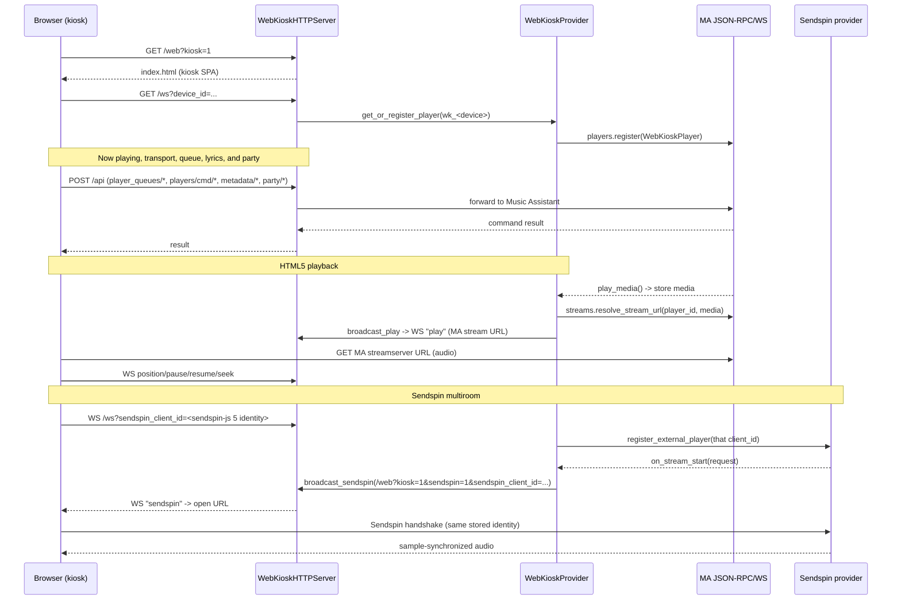

## Problem Statement

A user who only wants a fullscreen, always-on browser kiosk player (a spare
tablet, a Raspberry Pi display, or a TV's browser) today has to install the
MSX Bridge provider and use its `/web?kiosk=1` mode. The kiosk frontend and its
playback plumbing are embedded in the MSX Bridge provider, coupled to a Smart
TV protocol the kiosk user does not need, and cannot be configured, versioned,
or shipped independently.

## Solution Summary

Introduce a thin standalone `web_kiosk` player provider. It runs a minimal
embedded HTTP server that serves the kiosk SPA (`/web` and `/web?kiosk=1` are
the same player screen), a per-player push WebSocket (`/ws`), a health
endpoint (`/health`), and the tokenized `/stream` redirect. It registers each
browser as a dedicated `WebKioskPlayer` (`wk_`-prefixed id). Music is chosen
in Music Assistant. The screen shows the current item and sends transport,
volume, queue, lyrics, and party commands through a same-origin proxy to MA's
JSON-RPC API (`POST /api`). HTML5 audio is served by
the MA streamserver; Sendspin multiroom is provided by a web-kiosk bridge role
that registers the kiosk as an external Sendspin client and opens the kiosk in
Sendspin mode when a synchronized stream starts. The corresponding
functionality in `msx_bridge` is marked deprecated (CHANGELOG + docs only,
behaviour unchanged) for removal in a future release.

## Acceptance Criteria

1. Installing the `web_kiosk` provider serves `/web` and registers a browser
   client as a Music Assistant player (`wk_`-prefixed id) with the
   PLAY_MEDIA / PAUSE / SEEK / VOLUME_SET feature set.
2. The provider's own HTTP server serves the kiosk SPA, the per-player push
   WebSocket, `/health`, and `/stream`. It proxies `POST /api` and image
   requests to Music Assistant so the page stays on one origin. It does not
   implement its own library.
3. The kiosk screen shows the current item, transport, volume, queue, lyrics,
   and party status. Those commands go through the same-origin proxy. Browsing
   and search stay in Music Assistant. `/web` and `/web?kiosk=1` both open
   this screen.
4. HTML5 playback works: the provider resolves a MA streamserver URL for the
   player's current media and pushes it to the kiosk over `/ws`; the kiosk
   reports `position`/`pause`/`resume`/`seek` and the provider updates player
   state.
5. Sendspin multiroom works on Music Assistant 2.11 (aiosendspin 10.0.0,
   Sendspin 1.0.0-rc1): the kiosk vendors sendspin-js 5.0.0, announces that
   browser's cryptographic client id, and the bridge registers the external
   player under the same id. A synchronized stream opens the kiosk in Sendspin
   mode; the JS client connects with the stored identity and takes over the
   bridge. When Sendspin is unavailable the provider degrades to HTTP playback
   without failing to load. sendspin-js 5.0.0 is the newest published client
   and speaks the wire aiosendspin 10 still accepts while legacy clients are
   allowed (the 2.11 default).
6. `msx_bridge` marks its web-kiosk functionality deprecated via a canonical
   `### Deprecated` CHANGELOG entry and doc notes only; runtime behaviour and
   URLs stay unchanged.
7. The provider passes `ma_verify` (ruff format/check, mypy, pytest,
   pre-commit) and `ma_consistency features`.

## Test Plan

- `tests/test_init.py` — pins manifest/domain, `SUPPORTED_FEATURES`, and the
  config entries exposed by `get_config_entries`.
- `tests/test_provider.py` — provider lifecycle: HTTP server start/stop,
  player registration under the `wk_` prefix, stream-token derivation, idle
  timeout, Sendspin bridge availability degradation.
- `tests/test_player.py` — `WebKioskPlayer` state machine: play/pause/resume/
  stop/seek/volume, WS position acceptance, poll availability.
- `tests/test_http_server.py` — `/web`, `/ws`, `/health` routes; stream URL
  push payload; cross-site rejection (403).
- `tests/test_sendspin_bridge.py` — browser client-id acceptance, bridge
  policy, stream-start → kiosk-open, connect timeout fallback to HTTP,
  identity replacement.
- `tests/test_sendspin_assets.py` — vendored sendspin-js 5.0.0 imports resolve
  for a browser loading the static tree.
- Manual: open `/web` and `/web?kiosk=1`, confirm both are the player screen,
  start playback from Music Assistant, and confirm title, duration, transport,
  volume, queue, lyrics, and party QR. With Sendspin enabled, confirm
  synchronized playback in a group.

## Sequence Diagram

```mermaid
sequenceDiagram
    participant B as Browser (kiosk)
    participant K as WebKioskHTTPServer
    participant P as WebKioskProvider
    participant M as MA JSON-RPC/WS
    participant S as Sendspin provider

    B->>K: GET /web?kiosk=1
    K-->>B: index.html (kiosk SPA)
    B->>K: GET /ws?device_id=...
    K->>P: get_or_register_player(wk_<device>)
    P->>M: players.register(WebKioskPlayer)

    Note over B,K: Now playing, transport, queue, lyrics, and party
    B->>K: POST /api (player_queues/*, players/cmd/*, metadata/*, party/*)
    K->>M: forward to Music Assistant
    M-->>K: command result
    K-->>B: result

    Note over B,P: HTML5 playback
    M-->>P: play_media() -> store media
    P->>M: streams.resolve_stream_url(player_id, media)
    P->>K: broadcast_play -> WS "play" (MA stream URL)
    B->>M: GET MA streamserver URL (audio)
    B->>K: WS position/pause/resume/seek

    Note over B,S: Sendspin multiroom
    B->>K: WS /ws?sendspin_client_id=<sendspin-js 5 identity>
    P->>S: register_external_player(that client_id)
    S-->>P: on_stream_start(request)
    P->>K: broadcast_sendspin(/web?kiosk=1&sendspin=1&sendspin_client_id=...)
    K-->>B: WS "sendspin" -> open URL
    B->>S: Sendspin handshake (same stored identity)
    S-->>B: sample-synchronized audio
```

## Data Model

New provider config entries (all in `strings.json`):

| key | type | default | notes |
|-----|------|---------|-------|
| `http_port` | INTEGER | `8098` | embedded HTTP server port (distinct from msx_bridge's 8099) |
| `player_idle_timeout` | INTEGER | `30` | minutes; unregister idle kiosk players |
| `show_stop_notification` | BOOLEAN | `false` | include `showNotification` in WS `stop` |
| `enable_sendspin_bridge` | BOOLEAN | `true` | register kiosk as external Sendspin client |

Player id scheme: `wk_<sanitized device_id or ip>` (prefix `WEB_KIOSK_PLAYER_ID_PREFIX`).
Sendspin bridge client id: the sendspin-js 5.0.0 identity the browser announces
on `/ws` (`sendspin_client_id`, base64url, 16–128 chars). It is not derived
from the `wk_` player id. A synthetic `spb_wk_` id is rejected.

WebSocket messages (MA → kiosk): `play`, `stop`, `pause`, `resume`, `seek`,
`volume`, `sendspin`. WebSocket messages (kiosk → MA): `position`, `pause`,
`resume`, `seek`.

The `play` message carries the song `duration` and `start`, the offset where
the served audio begins in that song. A following `seek` carries seconds into
the served audio. The on-screen clock is `start` plus that position.

Lyrics and party status are read through MA's native JSON-RPC API
(`metadata/get_track_lyrics`, `party/url`, `party/config`). The single
provider-owned display endpoint is `/api/party/qr.svg`, which renders the join
QR server-side because MA's native API exposes only the join URL, not a QR
image.
